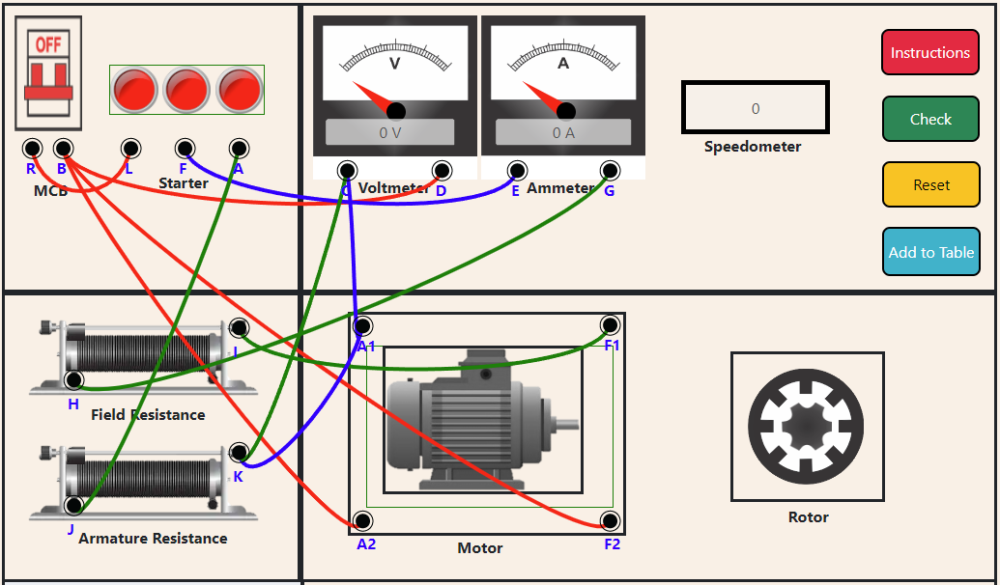

The following procedure is to be followed for the simulation:

1. Make the proper Connections as per the Instructions.
	a) first of all connect the  + (positive) terminal of  MCB to  the (-)negative terminal of Voltmeter(V) and  to the motor's A2 and F2 Port respectively .  
	b) Connect  - (negative) terminal of MCB  to the L port  of the Starter. 
	c) Connect The F port of the starter to the positive (+) terminal of the Ammeter(A).  
	d) Connect the A port of starter to the positive (+) terminal of the Armature Resistance . 
	e) Connect the positive(+) terminal of the voltmeter(V) to the negative(-) terminal of the Armature Resistance and to the motor's A1 Port respectively. 
	f) Connect Ammeter's negative(-) terminal to the positive(+) terminal of the Field Resistance. 
	g) Connect Negative (-) Terminal of the Field Resistance to the Port F1 of the Motor.  
	h) Connect Port A1 of the Motor to the  Negative (-) terminal of the Armature Resistance. 
	

 
2. Tap on the MCB to turn on the circuit.</li>
3. Move slider second to get variations over the voltmeter readings.
4. Then tap on  Add to Table Button to values to table.
5. Repeat steps  3 &  4 to add more values in table
6. After getting 6 or more rows on table then click on Create Graph button to make a respective graph   regarding the values in above table.
7. In order to print the page  click on Print button .

Note: The Create Graph button is disabled untill you switch on the MCB 