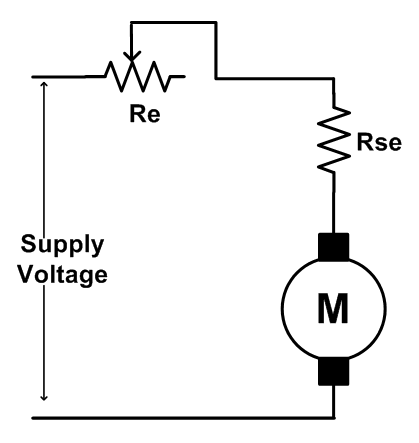

### Introduction

We know that the speed of DC motor is given by: 

N = (V-IaRa)/kФ 

The above equation shows that the speed depends upon the supply voltage V, the armature circuit resistance Ra, and the field flux Ф, which is produced by the field current. In practice, the variation of these three factors is used for speed control. Thus, there are three general methods of speed control of D.C. Motors. 

1. Resistance variation in the armature circuit. This method is called armature resistance control or Rheostat control.  
2. Variation of field flux Ф. This method is called field flux control.  
3. Variation of the applied voltage. This method is also called armature voltage control.

<b> 
Fig. 1 Equivalent circuit for armature control of DC motor</b>

### Speed control by varying armature resistance

In this method a variable series resistor Rext is put in the armature circuit. In this case the field is directly connected across the supply and therefore 
the flux ɸ is not affected by variation of Rext. in this case the current and hence the flux are affected by the variation of the armature circuit resistance.
The voltage drop in Rext reduces the voltage applied to the armature and therefore the speed is reducing.
 
The slope of the n vs. Ia or n vs. Te characteristic can be modified by deliberately connecting external resistance rext in the armature circuit. One can 
get a family of speed vs. armature curves for various values of rext. From these characteristics it can be explained how speed control is achieved. Let us 
assume that the load torque TL is constant and field current is also kept constant.

Therefore, since steady state operation demands Te = TL, Te = kφ too will remain constant; which means Ia will not change. Suppose rext = 0, then at rated load torque, operating point will be at C and motor speed will be n. If additional resistance rext1 is introduced in the armature circuit, new steady state operating speed will be n1 corresponding to the operating point D. In this way one can get a speed of n2 corresponding to the operating point E, when rext2 is introduced in the armature circuit. This same load torque is supplied at various speed. Variation of the speed is smooth and speed will decrease smoothly if rext is increased. Obviously, this method is suitable for controlling speed below the base speed and for supplying constant rated load torque which ensures rated armature current always. Although, this method provides smooth wide range speed control (from base speed down to zero speed), has a serious draw back since energy loss takes place in the external 
resistance rext reducing the efficiency of the motor.  
 

<b> 
Fig. 2 Armature current speed characteristics of DC motors</b>

